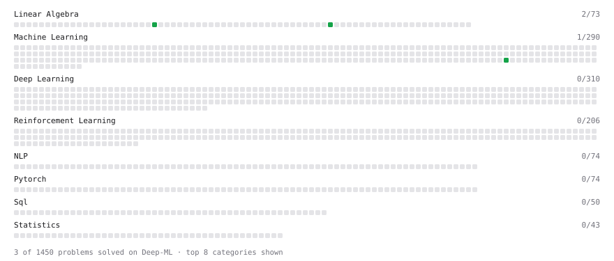

# Deep-ML

My machine learning practice from [Deep-ML](https://www.deep-ml.com). Every solution here was written by hand.

**4** solved · 3 problems · 0 labs · 1 math

[**Browse the interactive portfolio**](https://masaoIsh.github.io/deep-ml/) to replay this filling in over time.

## Problems

| | Difficulty | Solved | |
| --- | --- | --- | --- |
| [Implement Orthogonal Projection of a Vector onto a Line](https://www.deep-ml.com/problems/66) | easy | 2026-09-26 | [solution](problems/0066-implement-orthogonal-projection-of-a-vector-onto-a-line) |
| [L2 Normalization Along an Axis](https://www.deep-ml.com/problems/1022) | easy | 2026-09-23 | [solution](problems/1022-l2-normalization-along-an-axis) |
| [Pairwise Cosine Similarity Matrix](https://www.deep-ml.com/problems/1072) | easy | 2026-09-24 | [solution](problems/1072-pairwise-cosine-similarity-matrix) |

## Math

| | Difficulty | Solved | |
| --- | --- | --- | --- |
| [Gram–Schmidt and Orthonormal Bases](https://www.deep-ml.com/math-problems/47) | medium | 2026-09-26 | [solution](math/0047-gram-schmidt-and-orthonormal-bases) |

---

_This file is regenerated by Deep-ML on every push._
