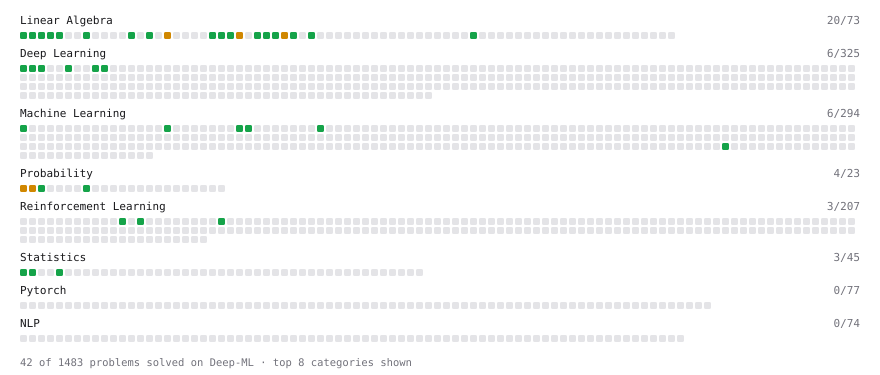

# Deep-ML

My machine learning practice from [Deep-ML](https://www.deep-ml.com). Every solution here was written by hand.

**23** solved · 22 problems · 0 labs · 1 math

[**Browse the interactive portfolio**](https://masaoIsh.github.io/deep-ml/) to replay this filling in over time.

## Problems

| | Difficulty | Solved | |
| --- | --- | --- | --- |
| [Calculate 2x2 Matrix Inverse](https://www.deep-ml.com/problems/8) | easy | 2025-12-24 | [solution](problems/0008-calculate-2x2-matrix-inverse) |
| [Calculate Cosine Similarity Between Vectors](https://www.deep-ml.com/problems/76) | easy | 2025-12-23 | [solution](problems/0076-calculate-cosine-similarity-between-vectors) |
| [Calculate Mean by Row or Column](https://www.deep-ml.com/problems/4) | easy | 2025-12-25 | [solution](problems/0004-calculate-mean-by-row-or-column) |
| [Convert Vector to Diagonal Matrix](https://www.deep-ml.com/problems/35) | easy | 2025-12-23 | [solution](problems/0035-convert-vector-to-diagonal-matrix) |
| [Descriptive Statistics Calculator](https://www.deep-ml.com/problems/78) | easy | 2025-12-24 | [solution](problems/0078-descriptive-statistics-calculator) |
| [Dot Product Calculator](https://www.deep-ml.com/problems/83) | easy | 2025-12-23 | [solution](problems/0083-dot-product-calculator) |
| [Empirical Probability Mass Function (PMF)](https://www.deep-ml.com/problems/184) | easy | 2025-12-28 | [solution](problems/0184-empirical-probability-mass-function-pmf) |
| [Expected Value and Variance of an n-Sided Die](https://www.deep-ml.com/problems/179) | easy | 2025-12-26 | [solution](problems/0179-expected-value-and-variance-of-an-n-sided-die) |
| [Implement Orthogonal Projection of a Vector onto a Line](https://www.deep-ml.com/problems/66) | easy | 2026-09-26 | [solution](problems/0066-implement-orthogonal-projection-of-a-vector-onto-a-line) |
| [Implement ReLU Activation Function](https://www.deep-ml.com/problems/42) | easy | 2025-12-29 | [solution](problems/0042-implement-relu-activation-function) |
| [Implementation of Log Softmax Function](https://www.deep-ml.com/problems/39) | easy | 2025-12-30 | [solution](problems/0039-implementation-of-log-softmax-function) |
| [L2 Normalization Along an Axis](https://www.deep-ml.com/problems/1022) | easy | 2026-09-23 | [solution](problems/1022-l2-normalization-along-an-axis) |
| [Matrix-Vector Dot Product](https://www.deep-ml.com/problems/1) | easy | 2025-12-23 | [solution](problems/0001-matrix-vector-dot-product) |
| [Pairwise Cosine Similarity Matrix](https://www.deep-ml.com/problems/1072) | easy | 2026-09-24 | [solution](problems/1072-pairwise-cosine-similarity-matrix) |
| [Poisson Distribution Probability Calculator](https://www.deep-ml.com/problems/81) | easy | 2025-12-23 | [solution](problems/0081-poisson-distribution-probability-calculator) |
| [Reshape Matrix](https://www.deep-ml.com/problems/3) | easy | 2025-12-23 | [solution](problems/0003-reshape-matrix) |
| [Scalar Multiplication of a Matrix](https://www.deep-ml.com/problems/5) | easy | 2025-12-23 | [solution](problems/0005-scalar-multiplication-of-a-matrix) |
| [Softmax Activation Function Implementation ](https://www.deep-ml.com/problems/23) | easy | 2025-12-29 | [solution](problems/0023-softmax-activation-function-implementation) |
| [Transpose of a Matrix](https://www.deep-ml.com/problems/2) | easy | 2025-12-23 | [solution](problems/0002-transpose-of-a-matrix) |
| [Vector Element-wise Sum](https://www.deep-ml.com/problems/121) | easy | 2025-12-24 | [solution](problems/0121-vector-element-wise-sum) |
| [Compute Orthonormal Basis for 2D Vectors](https://www.deep-ml.com/problems/117) | medium | 2026-09-30 | [solution](problems/0117-compute-orthonormal-basis-for-2d-vectors) |
| [Normal Distribution PDF Calculator](https://www.deep-ml.com/problems/80) | medium | 2025-12-27 | [solution](problems/0080-normal-distribution-pdf-calculator) |

## Math

| | Difficulty | Solved | |
| --- | --- | --- | --- |
| [Gram–Schmidt and Orthonormal Bases](https://www.deep-ml.com/math-problems/47) | medium | 2026-09-26 | [solution](math/0047-gram-schmidt-and-orthonormal-bases) |

---

_This file is regenerated by Deep-ML on every push._
